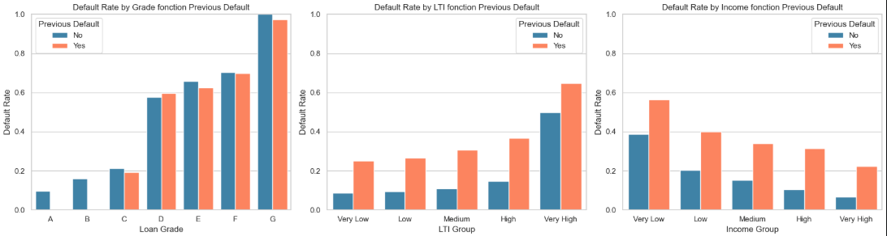
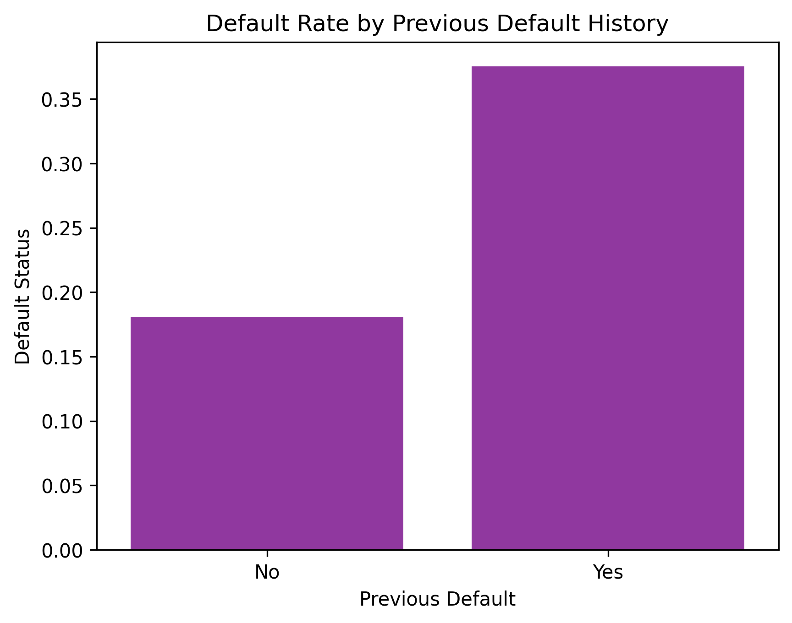
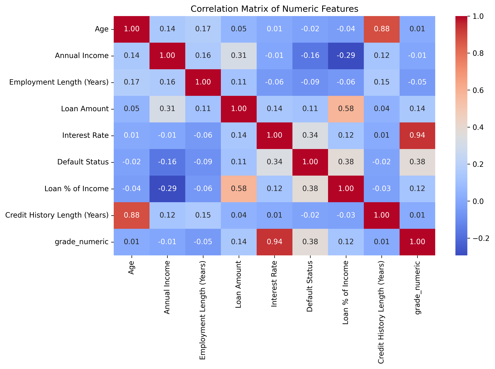
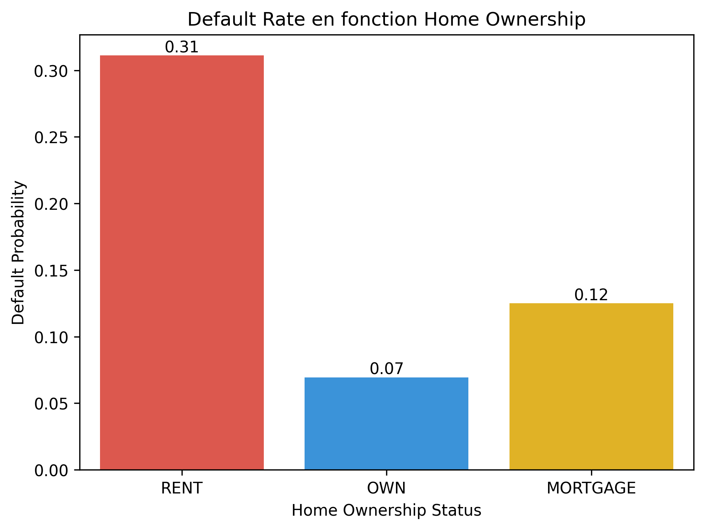
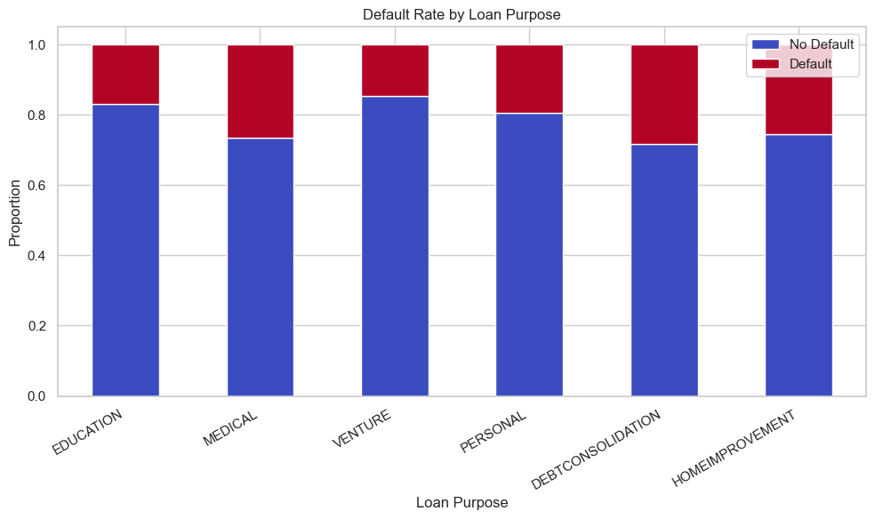
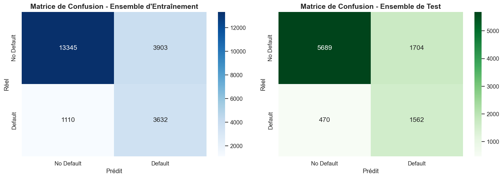

#  Credit Risk Analysis 

---
##  Objectif du projet
L’objectif de cette étude est d’identifier et d’analyser les facteurs associés à une probabilité élevée de défaut de paiement d’un prêt.  
Ce projet vise à construire un modèle prédictif afin d’aider à la prise de décision en matière d’octroi de crédit.

---

## Trois tendances distinctes émergent :

### 1. Grade
Le défaut antérieur apporte une information incrémentale limitée au sein des grades D à G — le grade capture déjà l’essentiel du signal de risque comportemental  
(R² = 28,76 % entre le grade et le défaut antérieur).

### 2. LTI (Loan-to-Income)
Le défaut antérieur se combine fortement avec le niveau d’endettement — un écart d’environ **15 à 20 points de pourcentage** est observé dans tous les groupes de LTI, et cet écart s’élargit pour les niveaux de LTI très élevés.

### 3. Revenu
Le défaut antérieur est indépendant du revenu — même les emprunteurs à revenu élevé ayant déjà fait défaut présentent un taux de défaut de **23 %**, soit près de **4 fois plus élevé** que leurs homologues sans défaut antérieur (6 %).

## Implication

Le défaut antérieur agit comme un signal comportemental indépendant par rapport au revenu et au ratio LTI, mais il est en grande partie déjà intégré dans la variable *grade de crédit*.

Sa contribution marginale dans un modèle incluant le grade doit donc être validée : sa valeur ajoutée pourrait être limitée aux segments qui ne sont pas suffisamment discriminés par le grade seul.

---

## Le comportement de défaut antérieur est un signal comportemental fort du risque futur de défaut.

La différence marquée entre les deux groupes indique que le comportement financier passé reflète des caractéristiques sous-jacentes des emprunteurs, telles que la discipline de remboursement et la stabilité financière.

Contrairement à de nombreuses variables financières qui nécessitent des transformations ou des regroupements, cette variable fournit une séparation claire et directe entre les niveaux de risque.

Cela suggère que le comportement historique capture des facteurs de risque qui ne sont pas entièrement observables à travers le revenu ou les caractéristiques du prêt uniquement.

---

## Corrélations clés avec le statut de défaut

Les résultats montrent plusieurs relations importantes entre les variables explicatives et le défaut de paiement.

Tout d’abord, le *Loan Grade* (codé numériquement) présente une corrélation positive relativement élevée avec le défaut (0,38), ce qui signifie que les grades plus risqués sont associés à une probabilité plus forte de défaut.

De manière similaire, le ratio *Loan / Income* est également positivement corrélé au défaut (0,38), indiquant que les emprunteurs qui consacrent une plus grande part de leur revenu au remboursement ont un risque plus élevé.

Le *taux d’intérêt* suit la même logique avec une corrélation positive de 0,34, suggérant que les prêts plus coûteux sont associés à des emprunteurs plus risqués.

---

## Redondance et multicolinéarité

L’analyse met également en évidence des problèmes de multicolinéarité entre certaines variables.

On observe une corrélation très forte entre le *taux d’intérêt* et le *Loan Grade* (0,94), ce qui suggère que ces deux variables capturent quasiment la même information de risque.

De même, l’*âge* et la *durée d’historique de crédit* sont fortement corrélés (0,88), indiquant une redondance dans la mesure de l’expérience financière des emprunteurs.

---

## Impact du statut de logement sur le risque de défaut

les emprunteurs ayant une situation de logement plus stable ou plus sécurisée ont tendance à moins faire défaut.

Le fait de posséder entièrement son logement (*OWN*) est associé au risque le plus faible, ce qui reflète probablement une meilleure stabilité financière et moins de charges récurrentes.

Les emprunteurs ayant un prêt immobilier (*MORTGAGE*) se situent dans une position intermédiaire : ils ont une dette, mais présentent néanmoins un risque plus faible que les locataires.

À l’inverse, le statut *RENT* apparaît comme le groupe le plus risqué. Cela peut s’expliquer par une moindre capacité d’épargne ou une stabilité financière plus faible.

Le statut de logement apporte une information pertinente sur le risque de défaut.
Globalement, cette variable enrichit l’analyse en permettant de mieux distinguer les profils d’emprunteurs stables et moins stables.

---

## Défaut de paiement en fonction des motifs de souscription des prêts

Les prêts de type Debt Consolidation et Medical présentent les taux de défaut les plus élevés.
À l’inverse, les prêts pour Education et Venture affichent des taux de défaut relativement plus faibles.
Les différences entre catégories sont modérées mais restent statistiquement exploitables pour la prédiction.
Ainsi, le Loan Purpose a un pouvoir discriminant réel sur le risque de défaut.

---
# Modélisation

##  Données et Variables du Modèle

###  Variables sélectionnées

Les variables retenues pour la modélisation ont été choisies en fonction de leur pertinence économique et statistique dans l’explication du risque de défaut.

| Variable                         | Description                              | Valeurs manquantes |
|----------------------------------|------------------------------------------|--------------------|
| Previous Default                 | Indique si l’emprunteur a déjà fait défaut | 0                  |
| Loan Grade                       | Qualité du prêt (notation du risque)     | 0                  |
| Loan % of Income                 | Ratio prêt / revenu                      | 0                  |
| Annual Income                    | Revenu annuel de l’emprunteur            | 0                  |
| Employment Length (Years)        | Ancienneté professionnelle (années)      | 0                  |
| Age                              | Âge de l’emprunteur                      | 0                  |
| Credit History Length (Years)    | Durée de l’historique de crédit          | 0                  |
| Interest Rate                    | Taux d’intérêt du prêt                   | 0                  |

>  Aucune valeur manquante n’a été observée dans les variables sélectionnées.

---

###  Dimensions du dataset

- Nombre total d’observations : **31 415**
- Nombre de variables explicatives : **8**

---

###  Variable cible

La variable cible est :

- `Default Status`
  - **0** : Non défaut  
  - **1** : Défaut  

#### Distribution globale

| Classe | Nombre | Proportion |
|--------|--------|------------|
| 0 (Non défaut) | 24 641 | 78% |
| 1 (Défaut)     | 6 774  | 22% |

>  Le dataset est **déséquilibré**, avec une majorité de non-défauts.

---

###  Séparation des données

Les données ont été divisées en deux ensembles :

| Ensemble | Nombre d’observations | Proportion |
|----------|----------------------|------------|
| Train    | 21 990               | 70%        |
| Test     | 9 425                | 30%        |

---

###  Distribution dans l’échantillon d’entraînement

| Classe | Proportion |
|--------|------------|
| 0 (Non défaut) | 0.78 |
| 1 (Défaut)     | 0.22 |

>  La distribution est conservée après le split (stratification).

---
# Résultat

---
### 📈 Performances globales

| Métrique   | Train | Test |
|------------|-------|------|
| Accuracy   | 0.7720 | 0.7693 |
| Precision  | 0.4820 | 0.4783 |
| Recall     | 0.7659 | 0.7687 |
| F1-Score   | 0.5917 | 0.5897 |
| ROC-AUC    | 0.8413 | 0.8387 |

---
## Interprétation
- Le modèle présente une **bonne capacité de généralisation**, avec des performances très proches entre train et test donc pas d’overfitting notable  
- Le **ROC-AUC élevé (~0.84)** indique une bonne capacité de discrimination entre défaut et non défaut  
- Le **recall élevé (~77%) pour la classe Default** est un point fort ainsi le modèle détecte bien les emprunteurs à risque  
- En revanche, la **precision faible (~48%)** indique un nombre important de faux positifs  
- L’accuracy (~77%) est à interpréter avec prudence en raison du **déséquilibre des classes**

---
# Cloner le repo
git clone https://github.com/YATABARE-Cheikna-Amala/Projet-Final-Python_Pour_la_Data_Science

# Aller dans le dossier
cd Projet-Final-Python_Pour_la_Data_Science

# Lancer le notebook
jupyter notebook (Run All)

---